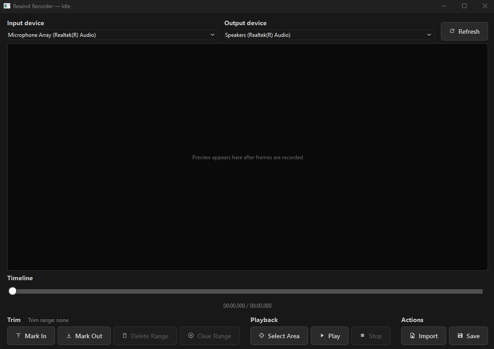

# Rewind Recorder

Open-source screen recorder that lets you pause, rewind, and re-record over any mistakes — no need to throw away the whole take and start from scratch. Runs locally on Windows; nothing leaves your machine.

[](https://github.com/nikolsen1234-bit/rewind-recorder/actions/workflows/ci.yml)
[](LICENSE)



## Install

```powershell
pip install rewind-recorder
```

Latest unreleased build:

```powershell
python -m pip install git+https://github.com/nikolsen1234-bit/rewind-recorder.git
```

## Run

```powershell
rewind-recorder
```

Pick a screen region, choose audio devices, hit **Start Recording**. Pause whenever, drag the timeline back, hit Record again to redo that part. Trim with **Mark In** / **Mark Out**, preview, then **Save** to MP4.

## Requirements

Windows 10 or 11, Python 3.11+.

## Contributing

```powershell
git clone https://github.com/nikolsen1234-bit/rewind-recorder.git
cd rewind-recorder
python -m pip install -e .
```

PRs welcome. [Open an issue](https://github.com/nikolsen1234-bit/rewind-recorder/issues) for bugs or feature requests.

## License

[MIT](LICENSE).
